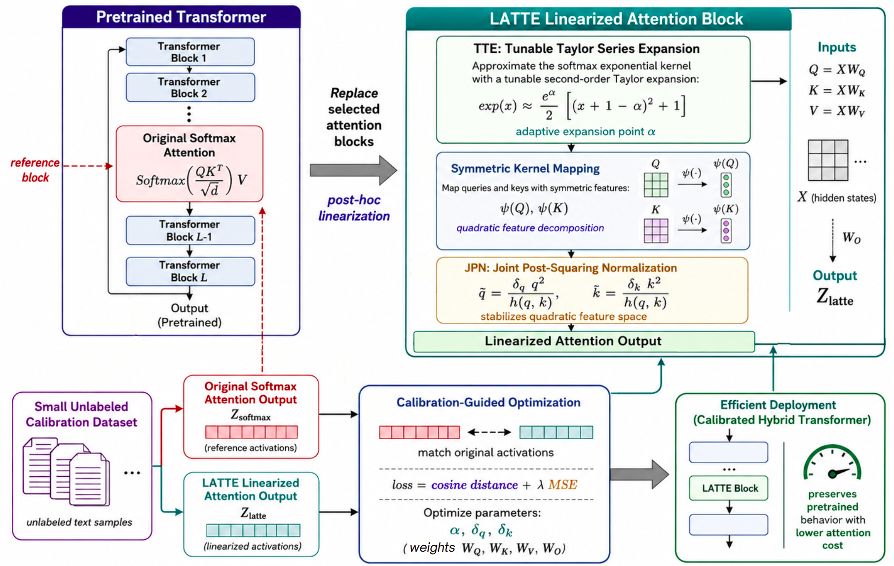

# **[ECCV 2026] LATTE**: Plug-and-Play Attention Linearization for Pretrained Transformers

Kenan Kassab · Alexey Kashevnik · Ammar Ali · Stamatios Lefkimmiatis

Official implementation of **Plug-and-Play Attention Linearization for
Pretrained Transformers**. LATTE replaces selected softmax attention blocks
with calibrated linear attention, using a small unlabeled dataset without
full model retraining.

<p align="center">
  
</p>

LATTE combines **Tunable Taylor Series Expansion (TTE)**,
**Joint Post-Squaring Normalization (JPN)**, and **sensitivity-guided layer
selection** to construct a hybrid Transformer.

This repository applies LATTE (Linearized Attention with Tunable Taylor
Expansion) to the decoder self-attention layers of pretrained DETR and
RT-DETR. Each linear layer is initialized from the original projections and
calibrated on a small COCO subset without full model retraining.

## 🚀 Installation

The reference environment uses Python 3.10.19, PyTorch 2.10.0, TorchVision
0.25.0, and Transformers 5.2.0.

```bash
git clone https://github.com/your-account/LATTE.git
cd LATTE
conda env create -f environment.yml
conda activate latte
```

To use an existing compatible environment:

```bash
pip install -e .
```

## 🔧 Dataset paths

The calibration and evaluation commands expect a local COCO 2017 structure:

```text
coco/
├── images/
│   ├── train2017/
│   └── val2017/
└── annotations/
    ├── instances_train2017.json
    └── instances_val2017.json
```

Replace the placeholder paths in:

- `configs/rtdetr_debug.yaml`
- `configs/rtdetr_calibration.yaml`
- `configs/rtdetr_evaluation.yaml`
- `configs/detr_debug.yaml`
- `configs/detr_calibration.yaml`
- `configs/detr_evaluation.yaml`

## RT-DETR calibration

Start with the small one-layer debug run:

```bash
run_latte_rtdetr --config configs/rtdetr_debug.yaml
```

Then run the complete calibration:

```bash
run_latte_rtdetr --config configs/rtdetr_calibration.yaml
```

`run_latte` is a shorter alias for the same RT-DETR calibration command.

The pipeline performs the following steps:

1. Loads `PekingU/rtdetr_r50vd`.
2. Loads the configured COCO training subset.
3. Captures hidden states, positional embeddings, and original attention
   outputs for a small chunk of decoder layers.
4. Initializes LATTE from the corresponding pretrained projection weights.
5. Optimizes the selected parameters with cosine and MSE losses.
6. Saves calibrated states and final per-layer losses.

## DETR calibration

Start with the DETR debug configuration:

```bash
run_latte_detr --config configs/detr_debug.yaml
```

Then run the full DETR calibration:

```bash
run_latte_detr --config configs/detr_calibration.yaml
```


## 📊 Evaluation

RT-DETR:

```bash
eval_latte_rtdetr --config configs/rtdetr_evaluation.yaml
```

DETR:

```bash
eval_latte_detr --config configs/detr_evaluation.yaml
```

Layers are ranked using:

```text
score = cosine_weight × cosine_loss + mse_weight × mse_loss
```

The default configuration uses `cosine_weight: 1.0` and `mse_weight: 10.0`.
For every requested linearization depth, both evaluators report COCO AP and
AP50. Temporary COCO prediction data is deleted after each evaluation. The
only retained evaluation artifacts are:

```text
outputs/rtdetr_coco_results.json
outputs/detr_coco_results.json
```

Example result record:

```json
{
  "num_layers": 4,
  "linearized_layers": [0, 1, 3, 5],
  "metrics": {
    "AP@[IoU=0.50:0.95]": 0.0,
    "AP@[IoU=0.50]": 0.0
  }
}
```

## Use a calibrated checkpoint

RT-DETR:

```bash
python examples/linearize_rtdetr.py \
  --checkpoint checkpoints/rtdetr_r50vd_latte.pth \
  --num-layers 4 \
  --lambda-mse 10
```

DETR:

```bash
python examples/linearize_detr.py \
  --checkpoint checkpoints/detr_resnet50_latte.pth \
  --num-layers 4 \
  --lambda-mse 10
```

To specify exact decoder layers:

```bash
python examples/linearize_rtdetr.py \
  --checkpoint checkpoints/rtdetr_r50vd_latte.pth \
  --layers 0 1 3 5
```

Inspect the saved calibration losses:

```bash
python examples/inspect_checkpoint.py checkpoints/rtdetr_r50vd_latte.pth
```

## Testing

```bash
pip install -r requirements-dev.txt
pytest -q
```

The unit tests do not download DETR, RT-DETR, or COCO.

## Citation

If you use LATTE in your research, please cite our paper:

```bibtex
@inproceedings{kassab2026latte,
  title     = {Plug-and-Play Attention Linearization for Pretrained Transformers},
  author    = {Kassab, Kenan and Kashevnik, Alexey and Ali, Ammar and Lefkimmiatis, Stamatios},
  booktitle = {European Conference on Computer Vision (ECCV)},
  year      = {2026}
}
```

## License

This project is licensed under the [MIT License](LICENSE).

